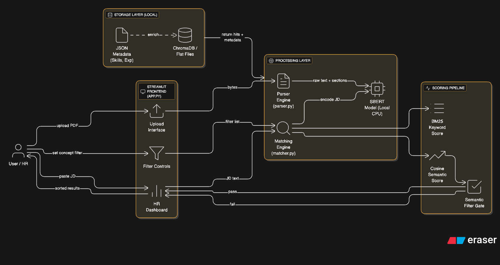

 # 🏗️ System Architecture
 
 This document outlines the technical design of the TalentScout AI Resume Matcher.
 
 ## 1. High-Level Data Flow
 
 The system follows a Retrieval-Augmented Generation (RAG) pattern optimized for ranking rather than generation.
 

 - **Ingestion**: PDF → Text Sections → Vectors → ChromaDB
 - **Retrieval**: JD Text → Vector → Cosine Search → Candidate Pool
 - **Ranking**: Candidate Pool → BM25 + Semantic Filters → Final Weighted Score
 
 ## 2. Core Modules
 
 ### `parser.py` — Ingestion Layer
 - Converts raw PDF bytes into structured data.
 - Uses PyMuPDF (fitz) for text extraction.
 - `_chunk_sections` relies on regex heuristics to detect sections such as Skills, Experience, Education.
 - Detects scanned PDFs by flagging documents where extracted text length < 50 characters.
 
 ### `vector_store.py` — Data Layer
 - Manages ChromaDB connections and persisted embeddings.
 - Embeddings for Skills and Experience are computed once at upload and stored in metadata, enabling O(1) retrieval during matching instead of recalculating each query.
 
 ### `matcher.py` — Intelligence Layer
 - Runs the ranking pipeline.
 - **Semantic score**: cosine similarity using `sentence-transformers/all-MiniLM-L6-v2`, weighting whole document (60%) plus Experience section (40%).
 - **Keyword score**: BM25Okapi to capture TF-IDF-style weighting, rewarding distinctive terms.
 - **Gap analysis**: derives JD vs. resume keyword sets to surface “Missing Skills”.
 - **Semantic filter**: drops candidates whose Experience vector similarity to a required concept falls below 0.25.
 
 ### `app.py` — Presentation Layer
 - Streamlit UI for indexing and matching.
 - Maintains session state to avoid redundant computation on widget changes.
 - Renders custom badge styling (green/red pills) for skill matches.
 
 ## 3. Local Storage
 - Data persists under `./chroma_db`.
 - To reset, delete the `chroma_db` directory and restart the app.
 
 ## 4. Future Roadmap
 - [ ] OCR integration (Tesseract) for scanned PDFs.
 - [ ] Local LLM (e.g., Llama 3) summaries explaining candidate fit.
 - [ ] Feedback loop to let HR “thumbs up” candidates and retrain weights.
